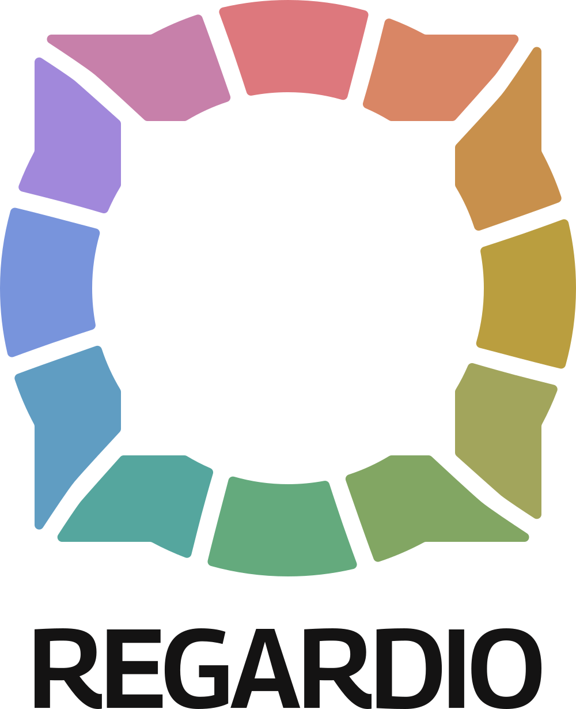
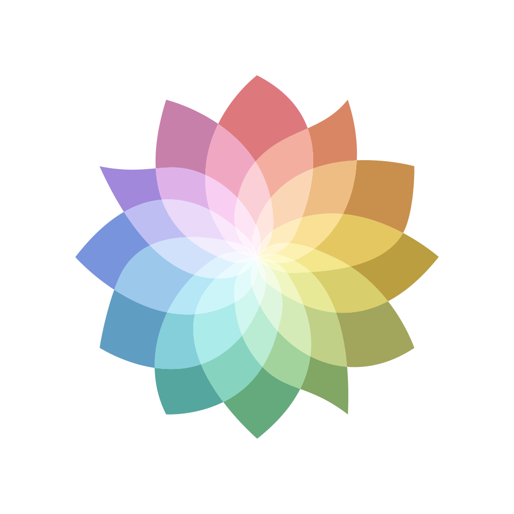

# Regardio Brand

> **Design system and branding for the Regardio ecosystem**

Regardio Brand provides the visual identity, design tokens, and brand guidelines
for all Regardio applications. It ensures consistent visual language and user
experience across the entire toolkit while supporting customization for
different deployment contexts.

## What is Regardio Brand?

Regardio Brand delivers comprehensive design system including:

- **Design Tokens** - Colors, typography, spacing, and visual constants
- **Brand Guidelines** - Logo usage, voice, tone, and visual identity standards
- **Asset Library** - Icons, illustrations, and branded graphics
- **Component Specifications** - Design specifications for UI components
- **Theme Variants** - Light/dark modes and accessibility considerations
- **Brand Extensions** - Guidelines for custom implementations and
white-labeling

This package serves as the foundation for visual consistency across all
Ensemble applications and enables organizations to maintain brand coherence
while using Ensemble tools.

## Getting Started

### Installation

```bash
npm install @regardio/brand
# or
bun add @regardio/brand
```

## Included Assets

The SVG assets live in `src/svg/` and are organized into:

- `icons/` — Wordmarks, product marks, and system icons for the Regardio brand
and the Regardio System
- `compass-base/` — System primitives and compositions (facets, steps, sparks,
bridges, pointers) used across product UI and documentation

Below are a few representative examples. Files are served directly from this
package and can be embedded as inline SVGs or referenced via your bundler.

### Brand Logos

<!-- markdownlint-disable MD033 -->
<p style="background:#f1eded">
  
  

</p>
<!-- markdownlint-enable MD033 -->

### Brand Icons

<!-- markdownlint-disable MD033 -->
<p style="background:#0f3b50">
  
  
  
  
</p>
<!-- markdownlint-enable MD033 -->

### System Icons

<!-- markdownlint-disable MD033 -->
<p>
  
  
  
  
  
  
</p>
<!-- markdownlint-enable MD033 -->

### Compass Card

<!-- markdownlint-disable MD033 -->
<p>
  
  
  
  
  
  
</p>
<!-- markdownlint-enable MD033 -->

## License

**Creative Commons Attribution-ShareAlike 4.0 International** (CC BY-SA 4.0):
Regardio Brand assets and guidelines are freely available for use and adaptation.

---

*Part of the [Regardio Ensemble](https://regard.io/ensemble) toolkit for
collective well-being.*
