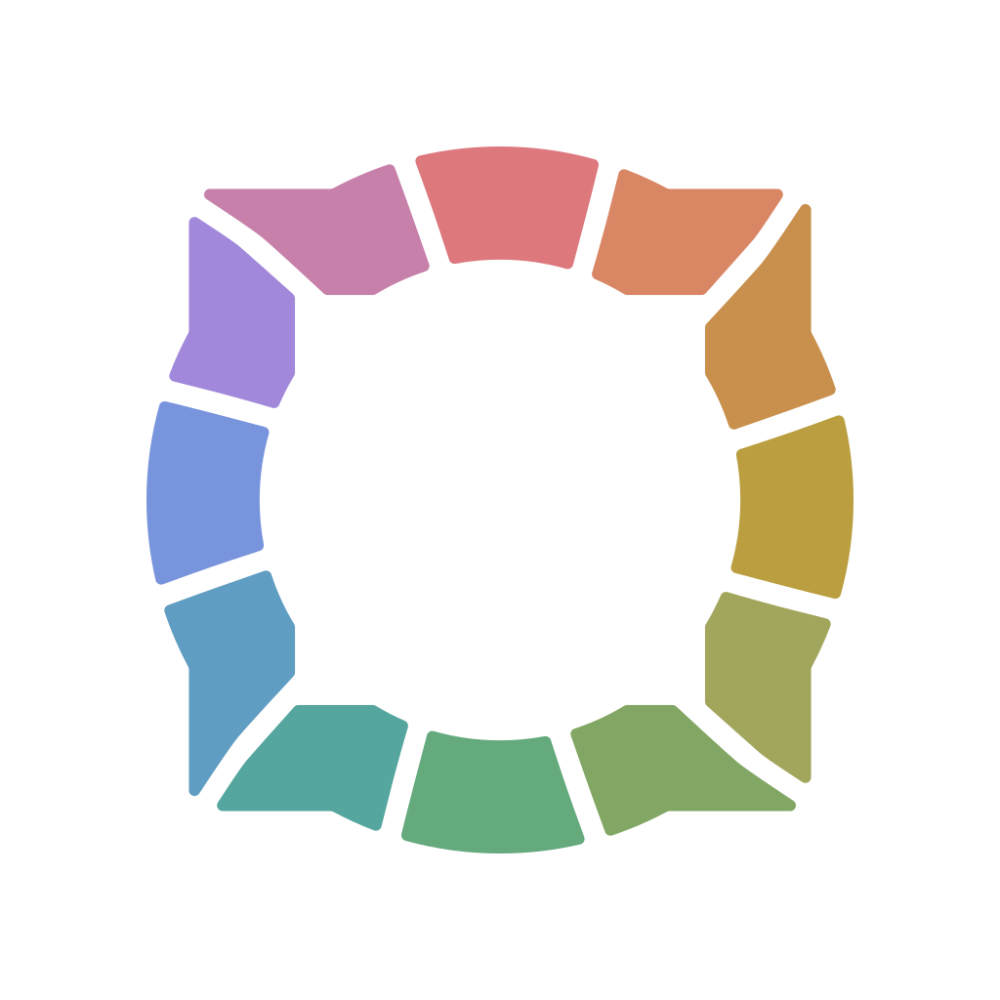

# Regardio Brand

> **Design system and branding for the Regardio ecosystem**

Regardio Brand provides the visual identity, design tokens, and brand guidelines
for all Regardio applications. The package includes both raw SVG files and
ready-to-use React components.

## Installation

```bash
pnpm add @regardio/brand
```

## Asset Catalog

Run Storybook to browse the complete asset catalog:

```bash
pnpm storybook
```

This opens an interactive catalog at `http://localhost:6006` with all icons,
logos, colors, and compass sprites.

## Sample Assets

<!-- markdownlint-disable MD033 -->
<p style="background:#f1eded; display: flex; gap: 16px; align-items: center; padding: 16px;">
  
  
  
  
</p>
<!-- markdownlint-enable MD033 -->

## Asset Categories

### SVG Files

Raw SVG assets are available in `src/svg/`:

- **`icons/`** — Regardio logos, icons, and system symbols
- **`compass-base/`** — Compass sprite components (facets, sparks, bridges, pursuits)

### React Components

Generated React components are exported from the package:

- **Logos** — `@regardio/brand/logos/*`
- **Icons** — `@regardio/brand/icons/*`
- **Sprites** — `@regardio/brand/sprites/*`

## Usage

### React Components

```tsx
import RegardioLogoColor from "@regardio/brand/logos/regardio-logo-color";
import RegardioIconColor from "@regardio/brand/icons/regardio-color";
import { CompassSprite } from "@regardio/brand/sprites/compass-sprite";
import { CompassSpriteProvider } from "@regardio/brand/sprites/compass-sprite-provider";

function App() {
  return (
    <CompassSpriteProvider>
      <RegardioLogoColor style={{ width: 200 }} />
      <RegardioIconColor style={{ fontSize: 48 }} />
      <CompassSprite id="spark.leisure.calm" width={80} height={80} />
    </CompassSpriteProvider>
  );
}
```

### CompassSpriteProvider

The `CompassSpriteProvider` embeds SVG symbol definitions for all compass sprites
directly into the DOM. Include it **once** at the root of your application:

```tsx
import { CompassSpriteProvider } from "@regardio/brand/sprites/compass-sprite-provider";

function App() {
  return (
    <CompassSpriteProvider>
      {/* Your app content */}
    </CompassSpriteProvider>
  );
}
```

Then use `CompassSprite` anywhere in your app to reference sprites by ID:

```tsx
import { CompassSprite } from "@regardio/brand/sprites/compass-sprite";

<CompassSprite id="spark.leisure.calm" width={80} height={80} />
<CompassSprite id="facet.element.people" width={60} height={80} />
<CompassSprite id="bridge.perspective.enables" width={100} height={70} />
```

### Regardio Color Scheme with Tailwind CSS

Import `colors.css` to use the Regardio color palette with Tailwind CSS v4:

```tsx
import "@regardio/brand/colors.css";
```

This provides CSS custom properties using the `@theme` directive, making colors
available as Tailwind utilities. The palette includes:

- **coral**, **orange**, **yellow**, **olive**, **lime**, **green**, **teal**, **cyan**, **blue**, **purple**, **pink**, **red** — full spectrum
- **gray** — neutral tones with warm undertones
- **white**, **black** — base colors

Each color has shades from `50` (lightest) to `950` (darkest):

```html
<div class="bg-coral-500 text-white">Coral background</div>
<div class="text-teal-700">Teal text</div>
<div class="border-purple-300">Purple border</div>
```

The compass sprites use these colors via Tailwind classes (e.g., `fill-green-300`),
so the color scheme must be loaded for sprites to render correctly.

## Scripts

| Script | Description |
|--------|-------------|
| `pnpm build` | Build TypeScript to `dist/` |
| `pnpm dev` | Watch mode for development |
| `pnpm generate` | Regenerate all React components from SVGs |
| `pnpm storybook` | Launch Storybook asset catalog |
| `pnpm storybook:build` | Build static Storybook site |
| `pnpm lint` | Run linting checks |
| `pnpm fix` | Auto-fix linting issues |
| `pnpm typecheck` | TypeScript type checking |

## Exports

| Export | Description |
|--------|-------------|
| `@regardio/brand/colors.css` | Tailwind v4 theme with Regardio color palette |
| `@regardio/brand/logos/*` | Logo React components |
| `@regardio/brand/icons/*` | Icon React components |
| `@regardio/brand/sprites/*` | Compass sprite components |

## License

**CC BY-SA 4.0** — Regardio Brand assets are freely available for use and adaptation.

---

*Part of the [Regardio Ensemble](https://regard.io/ensemble) toolkit for
collective well-being.*
